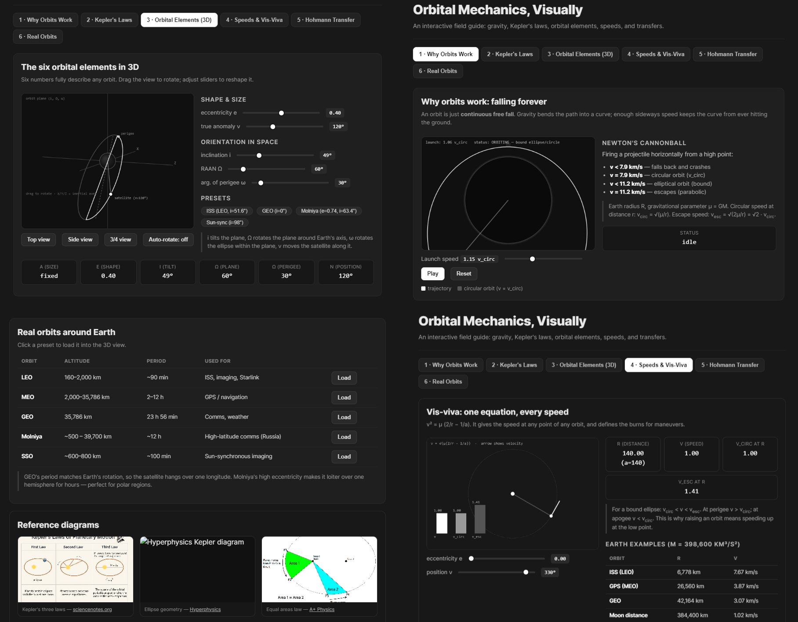
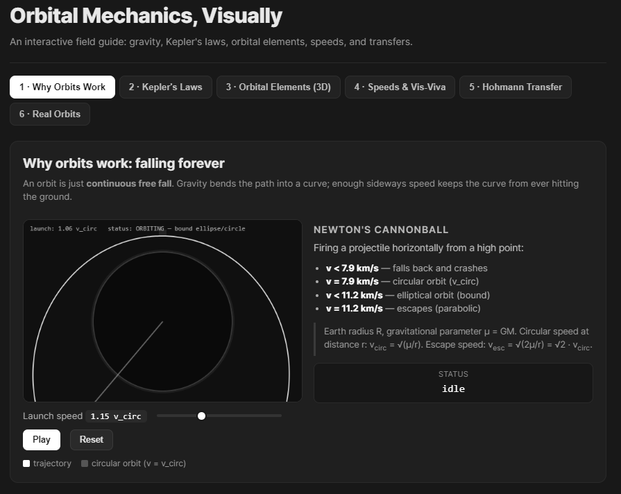
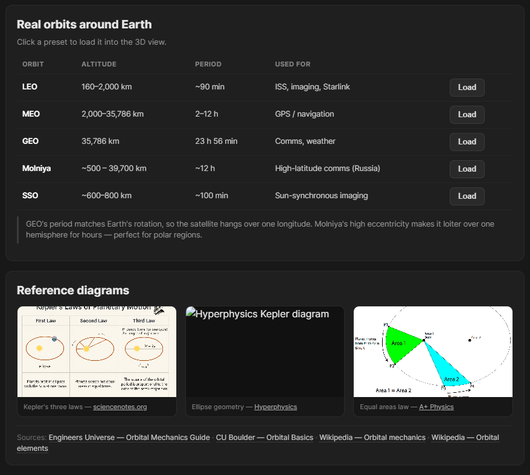
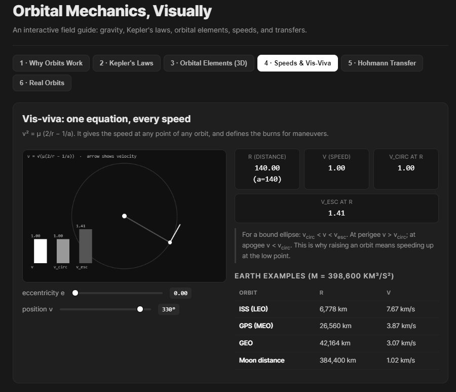

<h1 align="center">
  
Andromeda
</h1>

A LMM's output does not need to a wall of text with a million bullet points. Markdown is a great way to format text, but it also has limits against the sheer amount of text some of these LLM's use to answer questions.

Modern day LLM models have an unprecidented ability to Code beautiful and interactive Web pages.

So Andromeda is a Agent that can use the LLM's ability to code beautiful and interactive Web pages to answer questions in a more Visual and interactive way.

The following are some outputs from Andromeda:

Prompt : ```Teach me about Orbital mechanics Visually!!```

Model : ```DeepSeek V4 Flash 0731```

<table align="center">
  <tr>
    <td align="center">
      
    </td>
    <td align="center">
      
    </td>
  </tr>

  <tr>
    <td align="center">
      
    </td>
    <td align="center">
      
    </td>
  </tr>
</table>

Compared to using a normal LLM that outputs a wall of text with a million bullet points, Andromeda can output a beautiful and interactive Web page that can be used to teach the user about Orbital mechanics visually.

# Tool and Features
